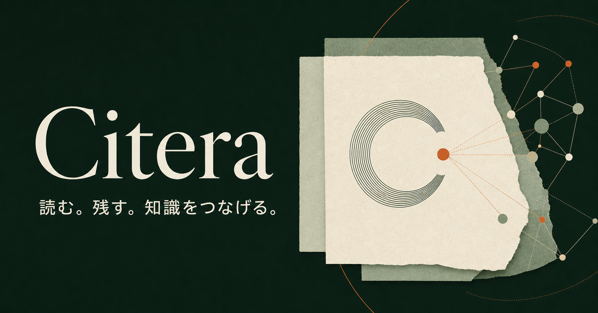

# Citera

読む。残す。知識をつなげる。

Citera は Cloudflare 上で個人運用する論文管理システムです。Web/PWA と Manifest V3 ブラウザ拡張から論文を保存し、D1 を正本、R2 を非公開ファイル置き場として、書誌情報・PDF・タグ・コレクション・Markdown メモを端末間で同期します。PWA shell と直近の一覧はオフラインでも開けますが、現在の UI からの更新操作はオンライン接続が必要です。



## 実装されている範囲

- React/Vite PWA: Google ログイン、ライブラリ、検索・状態/年/PDFフィルター、ソート、一括タグ/状態変更/削除/復元/既定形式 export、論文詳細、タグ/コレクション編集、PDF.js 表示、ページメモ、保存既定値、端末失効、使用量、バックアップ、確認付き account delete
- Hono Worker API: ユーザースコープ付き CRUD、論理削除/復元、楽観的排他、統一エラー、差分同期
- D1/Drizzle: 書誌、識別子、著者、タグ、コレクション、メモ、ファイル、セッション、変更ログ、ジョブ
- R2: method/key/type/checksum/実 Content-Length を拘束する本番の短寿命 S3 署名 URL と、完全ローカル開発用の認証済み Worker プロキシ
- Queue Worker: D1 durable outbox、Crossref/arXiv enrich、backup ZIP、再索引、R2/account cleanup の冪等 job と、手動/将来 producer 向け PDF verify handler
- メタデータ: 拡張機能による citation/DC/JSON-LD/DOI/arXiv 抽出、Crossref/arXiv exact lookup、provenance/confidence 付き候補、重複候補
- エクスポート: BibTeX、CSL-JSON、RIS、CSV、JSON と、設定上限内の PDF 同梱 ZIP backup
- Chromium 拡張: `activeTab` から抽出、Citera の Authorization Code + PKCE 認証、ワンクリック保存、安全性を検証できる PDF の R2 直接 upload、失敗時の書誌情報のみ保存
- Dexie: IndexedDB cache、同期 cursor、upload 状態と Outbox 用 schema。現在の Web UI mutation は Outbox へ enqueue していません

PDF text/XMP 抽出、ハイライト描画、OCR/AI 要約、ベクトル検索、Firefox 配布、巨大ライブラリの streaming backup/restore は初期リリースの対象外です。データモデルとジョブ境界は将来追加できるよう分離しています。

## リポジトリ

```text
apps/
  web/                 React/Vite PWA
  extension/           Manifest V3 extension
workers/
  api/                 Hono API + static web assets
  jobs/                Queue consumer + durable outbox dispatcher
packages/
  database/            Drizzle schema
  domain/              shared Zod schemas and types
  api-client/          typed fetch client
  metadata/            metadata contracts, merge and duplicate rules
  export/              export encoders
  sync/                conflict/outbox rules
  ui/                   shared UI primitives
  config/               shared TypeScript configs
migrations/            immutable D1 migrations
seeds/                 development-only local seed
tests/integration/     Worker/API integration tests
tests/e2e/             Playwright user flows
docs/                  architecture, API, security, deployment, ADRs
```

## 必要環境

- [mise](https://mise.jdx.dev/)
- Cloudflare アカウント（本番デプロイ時）
- Google OAuth client（本番ログイン時）
- Chrome/Chromium（拡張機能の確認時）

Node.js と pnpm は `.mise.toml` が固定します。グローバルの Node/pnpm に依存しません。

## セットアップ

```bash
mise trust
mise install
mise run setup
mise exec -- pnpm exec playwright install chromium
cp .dev.vars.example .dev.vars
cp .env.example .env
mise exec -- pnpm db:migrate:local
mise exec -- pnpm db:seed:local
```

`.dev.vars` の `TOKEN_HASH_PEPPER` と `IP_HASH_SALT` は別々のランダム値に置き換えてください。ローカルだけで試す場合は `AUTH_DEV_BYPASS=true`、`.env` の `VITE_ENABLE_DEV_LOGIN=true` を使えます。この経路は `ENVIRONMENT=production` では常に無効です。Web を `127.0.0.1` で開く場合は、その origin も `APP_ORIGIN` と `ALLOWED_ORIGINS` に揃えてください。

## ローカル起動

Web と API を起動（API assets 用 Web build を先に実行）:

```bash
mise run dev
```

個別起動:

```bash
mise exec -- pnpm dev:web
mise exec -- pnpm dev:api
mise exec -- pnpm dev:jobs
mise exec -- pnpm dev:extension
```

Jobs Worker は別 terminal の port `8790`、extension は watch build として起動します。`mise run dev` の対象は Web と API だけです。ローカル Queue の複数 Wrangler process 連携には制約があるため、Queue handler は integration test でも直接検証します。

- Web: `http://localhost:5173`
- API: `http://127.0.0.1:8787`
- Jobs Worker dev process: `http://127.0.0.1:8790`
- API health: `http://127.0.0.1:8787/health`

Wrangler のローカル D1/R2/Queues データは `.wrangler/state` に保存されます。本番の署名 URL は R2 S3 endpoint を使うため、ローカルでは Worker の認証済み PUT/GET 経路へ自動で切り替わります。

## テストと品質確認

```bash
mise exec -- pnpm lint
mise exec -- pnpm typecheck
mise exec -- pnpm test
mise exec -- pnpm test:integration
mise exec -- pnpm test:e2e
mise exec -- pnpm build
```

自動テストは production secrets を使いません。Google OAuth と production R2 presign は、callback/credential を設定した staging で別途 smoke test が必要です。特にブラウザは JavaScript から `Content-Length` を設定できず request body から自動導出するため、実ブラウザから remote R2 への signed PUT を確認してください。

## Cloudflare リソース

名前は例です。作成後、出力された ID を `wrangler.jsonc` の本番環境へ設定してください。

```bash
mise exec -- pnpm wrangler d1 create citera-db
mise exec -- pnpm wrangler r2 bucket create citera-files
mise exec -- pnpm wrangler queues create citera-jobs
mise exec -- pnpm wrangler queues create citera-jobs-dlq
```

D1 migration:

```bash
mise exec -- pnpm db:migrate:remote
```

R2 CORS:

```bash
mise exec -- pnpm wrangler r2 bucket cors set citera-files --file r2-cors.json
mise exec -- pnpm wrangler r2 bucket cors list citera-files
```

`r2-cors.json` の placeholder はデプロイ先 Web origin と `chrome-extension://<extension-id>` に置き換えます。API 側の `ALLOWED_ORIGINS` にも同じ Web/extension origins を設定します。callback 用の `https://<extension-id>.chromiumapp.org` は `ALLOWED_EXTENSION_IDS` から許可されます。R2 バケット自体は公開しません。

## OAuth

現在実装されている upstream provider は Google だけです。Google OAuth client に次の callback URL を登録し、同じ値を `GOOGLE_REDIRECT_URI` に設定します。本番では HTTPS の `APP_ORIGIN` と同じ origin、path は正確に `/v1/auth/callback/google`、query/fragment なしでなければ起動時検査と deploy preflight が拒否します。

```text
https://YOUR_DOMAIN/v1/auth/callback/google
```

開発用 callback URL:

```text
http://localhost:8787/v1/auth/callback/google
```

個人運用では `OWNER_EMAIL` を設定し、OAuth provider が返した verified email と一致する利用者だけを受け入れてください。拡張機能は Citera を OAuth authorization server として使い、Authorization Code + PKCE (S256) で短寿命 access token とローテーション refresh token を得ます。

## 必要な環境変数・secret

通常の設定値:

- `APP_ORIGIN`: Web の正規 origin
- `ALLOWED_ORIGINS`: Web origin と `chrome-extension://<id>` の comma-separated allowlist
- `OWNER_EMAIL`: 許可する所有者メールアドレス
- `GOOGLE_REDIRECT_URI`: 本番では `APP_ORIGIN` と同じ origin の正確な `/v1/auth/callback/google`
- `R2_ACCOUNT_ID`, `R2_BUCKET_NAME`: 32 桁 hex Cloudflare account ID と R2 S3 署名先 bucket
- `ALLOWED_EXTENSION_IDS`: 許可する拡張機能 ID
- `MAX_PDF_BYTES`, `MAX_USER_STORAGE_BYTES`, `MAX_EXPORT_BYTES`, `PRESIGN_TTL_SECONDS`: 1 PDF/owner storage/同期 metadata export 上限と短寿命 URL 設定（署名 URL は最大 900 秒）

secret（Wrangler secret に登録）:

- `TOKEN_HASH_PEPPER`: Web session / extension access・refresh token hash 用
- `IP_HASH_SALT`: rate-limit/IP fingerprint hash 用（token pepper と別値）
- `GOOGLE_CLIENT_ID`, `GOOGLE_CLIENT_SECRET`
- `R2_ACCESS_KEY_ID`, `R2_SECRET_ACCESS_KEY`: `citera-files` の Object Read & Write に限定

```bash
mise exec -- pnpm wrangler secret put TOKEN_HASH_PEPPER --env production --config wrangler.jsonc
mise exec -- pnpm wrangler secret put IP_HASH_SALT --env production --config wrangler.jsonc
mise exec -- pnpm wrangler secret put GOOGLE_CLIENT_ID --env production --config wrangler.jsonc
mise exec -- pnpm wrangler secret put GOOGLE_CLIENT_SECRET --env production --config wrangler.jsonc
mise exec -- pnpm wrangler secret put R2_ACCESS_KEY_ID --env production --config wrangler.jsonc
mise exec -- pnpm wrangler secret put R2_SECRET_ACCESS_KEY --env production --config wrangler.jsonc
```

秘密情報を `wrangler.jsonc`、`.env`、Git に保存しないでください。

## ブラウザ拡張機能

```bash
mise exec -- pnpm --filter @citera/extension build
```

1. Chrome の `chrome://extensions` を開く
2. デベロッパーモードを有効化
3. 「パッケージ化されていない拡張機能を読み込む」
4. `apps/extension/dist` を選択
5. オプション画面で Citera API URL を設定し、ログイン

拡張は `activeTab` を基本にし、Citera API と出版社 PDF を取得するときだけ対象 origin の optional permission を要求します。同一 origin の PDF だけを自動取得し、別 origin は宛先を表示した追加確認後に cookie/HTTP 認証を送らず取得します。localhost/private IP などは拒否し、redirect 先も毎回検証します。PDF を安全に取得できない場合は書誌情報だけ保存し、対象 PDF を直接開いて再試行するか Web から追加します。拡張内の任意ファイル選択はまだありません。

## デプロイ

詳細は [`docs/deployment.md`](docs/deployment.md) を参照してください。

```bash
mise run check
mise exec -- pnpm deploy:check
mise exec -- pnpm db:migrate:remote
mise run deploy
```

Web の静的成果物は API Worker の assets binding から配信され、`/v1/*` だけ Worker code が処理します。Jobs Worker は Queue の唯一の consumer です。

API/Jobs の Production 設定は `workers_dev=false` で `*.workers.dev` 公開を無効化するため、先に Cloudflare 側で API Worker の custom domain route を用意してください。`wrangler.jsonc`、`workers/jobs/wrangler.jsonc`、`r2-cors.json` の placeholder を実際の D1 ID・HTTPS origin/正確な Google callback・owner email・extension ID・32 桁 hex R2 account ID に置き換え、`mise exec -- pnpm deploy:check` を通してから migration/deploy します。Repository の template は誤デプロイを防ぐため、この preflight に意図的に失敗します。`mise run deploy` も同じ検査を先頭で実行します。

## バックアップ

設定画面から verified original PDF を含む ZIP backup を依頼できます。BibTeX/CSL-JSON/RIS/CSV/JSON は API も実装済みで、現 UI の選択 export は設定した既定形式、全件 backup は ZIP です。ZIP は Queue Worker が memory 上で生成し、R2 に期限付き download object として保存します。restore/import と manifest/SHA-256 検証 UI は未実装です。

## アカウント削除

設定画面で確認メールアドレスを入力すると、API は user tombstone、全 session family/session の失効、durable deletion job を同じ D1 batch に保存します。それ以降はログイン、既存 token、新しい非 deletion job を拒否します。物理削除は、最大 15 分の発行済み署名 URL と通常 15 分 lease の実行中 job を安全に失効・収束させるため最低 20 分待ち、他の running job がなくなってから owner の R2 prefix を再走査して D1 user を cascade delete します。Hourly Cron は terminal/stale deletion generation を進めて新しい outbox job を作り、途中停止した削除を回復します。

## 無料枠について

料金・上限値はコードに固定していません。デプロイ前と利用量増加時に公式ページを確認してください。

- [Workers pricing](https://developers.cloudflare.com/workers/platform/pricing/)
- [Workers limits](https://developers.cloudflare.com/workers/platform/limits/)
- [D1 pricing and limits](https://developers.cloudflare.com/d1/platform/pricing/)
- [R2 pricing](https://developers.cloudflare.com/r2/pricing/)
- [Queues pricing and limits](https://developers.cloudflare.com/queues/platform/pricing/)

無料枠では Worker CPU が小さいため、PDF 表示と SHA-256 計算はブラウザ、転送は R2 直接通信、バックグラウンド処理は短い冪等ジョブに寄せています。PDF text/XMP 解析は将来も client 側を主経路にする設計です。R2 は無料利用量内でも事前の利用有効化が必要です。

## 既知の制約

- ローカル R2 は S3 署名 URL を再現しないため、認証済み Worker proxy を使います。本番署名経路、とくにブラウザが body から導出する signed `Content-Length` は、使い捨て remote bucket で確認します。
- 出版社の認証が必要な PDF は server-side fetch しません。拡張機能は同一 origin だけ publisher session を使い、別 origin は明示確認後も credentials を送らないため、CSP/CORS/cookie policy や検証不能な redirect により書誌だけの保存へ fallback する場合があります。
- Runtime の provider 取得は DOI/arXiv の完全一致だけです。候補がない、または必須フィールドの信頼度が不足すると `needs_review` になります。Fuzzy search/ranking utility は provider 検索へ未接続です。
- FTS5 の環境差を避け、初期版は索引付き正規化列 + LIKE 検索です。移行条件は ADR に記録しています。
- PWA の cached shell/一覧は offline で開けますが、UI mutation を Dexie Outbox に積む配線は未実装です。offline での追加・メモ編集は保証しません。
- Web の一覧 UI が露出する filter/sort は検索・状態・年・PDF と主要 sort に限られます。API が持つ tag/collection/author/venue/rating/note/date/type filters と全 sort はまだ画面へ接続していません。
- 既存 tag/collection の論文への付け外しはできますが、tag/collection 自体の作成・rename・階層管理 UI はありません。全書誌フィールドの編集、metadata provenance 候補の選択、曖昧重複の解決アクションも未実装です。
- import input は現時点では UI placeholder です。
- Backup ZIP は streaming ではなく、`MAX_BACKUP_BYTES` の範囲で memory 上に生成します。大規模 library の backup/restore には未対応です。
- Google 以外の upstream OAuth provider は未実装です。Google ID token は JWKS/RS256 と issuer/audience/time/nonce を検証し、refresh token は family lineage を保って毎回 rotate します。古い token の再利用を検出すると family 全体を失効します。静的 asset 用 header は `apps/web/public/_headers` にありますが、custom domain の実 response で適用を確認してください。

## 設計資料

- [`docs/architecture.md`](docs/architecture.md)
- [`docs/data-model.md`](docs/data-model.md)
- [`docs/api.md`](docs/api.md)
- [`docs/security.md`](docs/security.md)
- [`docs/deployment.md`](docs/deployment.md)
- [`docs/decisions/`](docs/decisions/)
