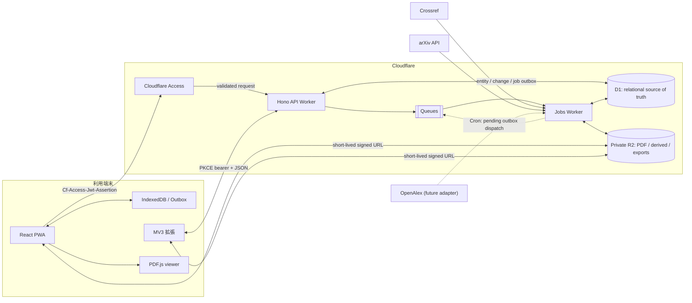
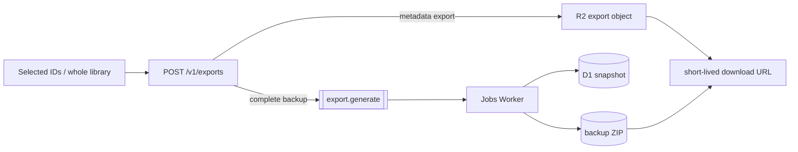

# Citera アーキテクチャ

## 方針

Citera は Cloudflare 以外の常時稼働 server を持たない、multi-user / personal-library システムです。D1 をメタデータ・権限・同期の正本、R2 を非公開 blob store、IndexedDB を端末キャッシュとして扱います。本番の利用者認証は Cloudflare Access、Worker内の認可は `library_members` で行います。ブラウザとAPIは同一オリジンで提供し、MVPの正規APIパスは `/api/v1`、`/v1` は互換パスとして残します。



## コンポーネント責務

| コンポーネント | 責務                                                                                      | 持たない責務                                                                       |
| -------------- | ----------------------------------------------------------------------------------------- | ---------------------------------------------------------------------------------- |
| Web/PWA        | UI、PDF.js 描画、SHA-256 upload、IndexedDB cache/cursor/outbox schema                     | 永続正本、provider token、R2 credential、現在の PDF text/XMP 抽出                  |
| Extension      | current page 抽出、同一 origin または明示確認済み PDF 取得、redirect 検証、R2 直接 upload | 任意 URL の server fetch、長期 access token、cross-origin PDF への credential 送信 |
| API Worker     | Access JWT検証、library認可、CRUD、署名発行、同期、短い export                                 | 重い PDF 処理、巨大 ZIP 生成                                                       |
| Jobs Worker    | 冪等 Crossref/arXiv enrich、PDF verify handler、reindex、backup ZIP、R2/account cleanup   | interactive response、複数 consumer、streaming ZIP                                 |
| D1             | relational data、session hash、change log、job idempotency                                | PDF bytes、平文 bearer token                                                       |
| R2             | PDF/derived/export blobs                                                                  | 公開配信、検索可能 metadata                                                        |

## PDF 保存フロー

```mermaid
sequenceDiagram
  participant C as Web / Extension
  participant A as API Worker
  participant D as D1
  participant R as Private R2
  participant Q as Queue

  C->>C: SHA-256 / size / type checks (extension also checks magic)
  C->>A: POST upload-url
  A->>A: authenticate + validate limit/key
  A->>D: create file row (pending)
  A-->>C: short PUT URL, default 5 min (local: proxy URL)
  C->>R: PUT exact key/body; browser-derived Content-Length is signed
  C->>A: POST files/{id}/complete
  A->>R: HEAD + range first bytes
  A->>A: verify actual size, required checksum and %PDF-
  A->>D: batch file=verified + change + durable job outbox
  A->>Q: best-effort immediate dispatch
  Note over D,Q: hourly Jobs Cron retries a pending outbox row
  A-->>C: verified (idempotent on retry)
```

R2 key は `users/{userId}/papers/{paperId}/original/{fileId}.pdf` のように server-generated ID だけから作ります。original filename は D1 metadata にのみ保存します。本番署名には bucket-scoped R2 API token と `aws4fetch` を使い、binding だけでは署名しません。PUT signature は method/key/type/checksum/`If-None-Match` に加えて申告した実 byte 数の `Content-Length` を拘束します。これは JavaScript から設定できない browser-forbidden header なので client へは返さず、Blob/ArrayBuffer body から user agent が同じ値を導出します。ローカル Miniflare では認証済み proxy adapter へ切り替えるため、この browser/R2 interaction は remote smoke test で検証します。

PDFは1論文に複数紐付けます。`file_kind`（本文、翻訳版、対訳版、補足資料、その他）、言語、表示名、並び順、既定PDFをD1に保存し、翻訳PDFの生成自体は利用者が外部ツールで行ってから手動登録します。失敗したアップロードは同じfile rowを再利用して再試行できます。

Jobs Worker には `pdf.verify` handler もありますが、通常 upload flow は API の complete endpoint で検証を終え、現在その handler を enqueue する producer はありません。

Queue を必要とする API mutation は entity/change と `job_outbox` row を同じ D1 batch に入れます。Response path では `waitUntil` で即時送信を試し、成功すれば dispatched にします。D1 commit 後に Queue が一時失敗しても pending row が残り、Jobs Worker の hourly Cron が再送します。再送が重複しても consumer 側の `type:entityId:sourceVersion` key と `job_runs` lease/terminal state が side effect を収束させます。

Account deletion は例外的に user row 自体を durable fence として使います。Request batch が `deletion_requested_at` と generation を設定して全 session を失効すると、API auth と consumer は新しい非 deletion work を拒否します。Deletion consumer は発行済み signed URL の最大 15 分と通常 job lease の 15 分を上回る 20 分を待ち、他の running job があれば retry してから R2 owner prefix を最終 sweep し、D1 user を cascade delete します。Hourly Cron は terminal/stale attempt を検出すると generation を増やした新しい outbox job を作り、古い generation を無効化して削除を再開します。

## メタデータ取得フロー

```mermaid
sequenceDiagram
  participant C as Client
  participant A as API
  participant D as D1
  participant Q as Queue
  participant J as Jobs Worker
  participant P as Fixed metadata providers

  C->>C: extension: citation/DC/JSON-LD extraction
  C->>A: POST ingestion + observed values; later complete
  A->>D: save values with source/confidence
  A->>Q: enqueue paper.enrich
  Q->>J: deliver idempotent job
  J->>P: DOI/arXiv exact lookup with timeout/cache
  P-->>J: provider response
  J->>J: normalize + confidence merge
  alt exact/high confidence
    J->>D: select fields unless user-edited
  else no provider result or insufficient essential fields
    J->>D: metadata_state=needs_review; retain available provenance
  end
```

`packages/metadata` には `MetadataProvider` contract、field merge、fuzzy scoring utility があります。Runtime Jobs Worker が現在 fetch するのは Crossref DOI と arXiv ID の exact endpoint だけです。OpenAlex/search adapter と PDF metadata extraction は未実装です。Ingestion は title/author/year/venue/abstract/URL と追加 `observedMetadata` を初期 paper row だけでなく field ごとの provenance row にも保存します。Manual input は confidence 1 の selected `user`、extension/web は `webpage`、import は `import`、PDF source は `pdf` として保存します。Refresh job は selected user fields、保存済み webpage/PDF/import candidate、exact provider candidate を統合し、既存 local provenance を複製せず Crossref/arXiv candidate だけを追加保存します。Job の `sourceVersion` が current paper と違えば metadata write を skip し、fetch 中の競合も guarded update と paper-version unique change row を含む D1 batch で rollback します。Current refresh が canonical paper row へ反映するのは scalar bibliography fields で、provider authors/identifiers は provenance candidate に残ります。`shouldAutoAccept(0.92, 0.08)` utility はありますが、runtime の provider search/ranking にはまだ接続していません。

## 同期フロー

```mermaid
sequenceDiagram
  participant I as IndexedDB
  participant C as Sync client
  participant A as API Worker
  participant D as D1

  Note over I,C: Pull sync is active; Web UI does not currently enqueue mutations
  opt An Outbox mutation exists
    C->>I: read outbox
    C->>A: POST /sync/mutations (clientMutationId)
    A->>D: version check + entity/change/result writes
    A-->>C: applied / conflict
  end
  C->>I: read cursor
  C->>A: GET /sync?cursor=N&limit=500
  A->>D: changes WHERE user_id=? AND sequence>N
  D-->>A: ordered snapshots/tombstones
  A-->>C: changes + nextCursor + hasMore
  C->>I: transactionally apply + advance cursor
```

同期 pull trigger は起動、focus、online 復帰、60 秒間隔です。`changes.data_json` に response snapshot/tombstone を持たせ、change ごとの再取得（N+1）を避けます。`client_mutations` は retry を記録済み結果へ収束させます。ただし現在の Web UI mutation は REST を直接呼び、Dexie Outbox へ enqueue しません。Pull apply が直接更新する Dexie table は paper/note/tag/collection で、file と `paper_tag` / `collection_paper` change は現在無視されます。Paper の完全な一覧/detail は online API fetch が cache を seed します。

Paper/note REST mutation は stored row version と `If-Match`、paper sync mutation は `baseVersion` で競合を検出します。Sync mutation が現在扱うのは paper update/delete/restore と tag/collection relation add/remove で、relation mutation は `baseVersion` を使いません。Tag/collection REST row にも version はありません。`packages/sync` に last-write-wins、user-edit 優先、note conflict copy、tombstone rule の pure utility はありますが、Web Outbox/REST route 全体にはまだ統合されていません。また、entity/change/mutation-result が単一 D1 transaction になっていない route があり、クラッシュ整合性は今後の hardening 項目です。

## エクスポートフロー

BibTeX/CSL-JSON/RIS/CSV/JSON は API Worker が同期生成して R2 に保存し、短寿命 download URL を返します。Library backup は Queue job が paper associations/provenance、notes/tags/collections、manifest、verified original PDFs を memory 上で ZIP にし、R2 に保存します。Supplement/derived files は現在 backup に含みません。どちらも client への streaming generation ではありません。



## 可用性と無料枠

- 論文一覧は1 query で author/tag/file/note flags を集約し、N+1 を避ける。
- 差分同期と metadata TTL/cache で D1 row reads と外部 API 呼び出しを抑える。
- PDF bytes は Worker を通常経由せず R2 と client の間で転送する。
- Free plan の小さい CPU budget を前提に、PDF parsing は client 側の将来境界とし、現在の server は size/checksum/magic 検証だけにする。Backup ZIP は設定した小さい上限内に留める。
- 料金/上限値は変化するため code に固定せず、公式 docs を運用時に参照する。

## 将来拡張境界

- OCR/AI summary は `MetadataProvider` と別の derived-asset job として追加する。
- Vector search は `SearchIndexer` interface の実装として追加する。
- Firefox は `apps/extension/src/lib/browser.ts` wrapper と別 manifest/callback allowlist で対応する。
- Collaboration/CRDT は change log の上に別 mutation strategy として追加し、初期 schema を壊さない。
