# データモデル

## 原則

- ID は type prefix 付き ULID-like value（例: `pap_...`, `usr_...`）。先頭 48 bit に millisecond timestamp を持ち、生成順が概ね時系列になる。
- 日時は UTC ISO 8601 text。D1 の `strftime` に依存せず application boundary で統一する。
- user-owned table と join table には `user_id` と必要に応じて `library_id` を持たせ、resource query は認証済み利用者の `library_members` を確認して scope する。クライアントから送られたlibrary IDは権限の根拠にしない。
- soft-delete 対象は `deleted_at` と change tombstone を残す。
- Paper と note は row に integer `version` を持ち、更新/削除時に `If-Match` で比較する。Tag と collection は現在 row version を持たず、change-log version だけを導出する。
- D1 には bearer token を保存せず、peppered SHA-256 hash だけを保存する。

## ER 図

```mermaid
erDiagram
  USERS ||--o| USER_PREFERENCES : configures
  USERS ||--o{ OAUTH_ACCOUNTS : owns
  USERS ||--o{ SESSION_FAMILIES : owns
  SESSION_FAMILIES ||--o{ SESSIONS : rotates
  USERS ||--o{ SESSIONS : owns
  USERS ||--o{ AUTHORIZATION_CODES : authorizes
  USERS ||--o{ PAPERS : owns
  USERS ||--o{ LIBRARY_MEMBERS : joins
  LIBRARIES ||--o{ LIBRARY_MEMBERS : contains
  LIBRARIES ||--o{ PAPERS : scopes
  USERS ||--o{ AUTHORS : owns
  USERS ||--o{ TAGS : owns
  USERS ||--o{ COLLECTIONS : owns
  USERS ||--o{ INGESTIONS : starts
  USERS ||--o{ FILES : stores
  USERS ||--o{ NOTES : writes
  USERS ||--o{ CHANGES : syncs
  PAPERS ||--o{ PAPER_IDENTIFIERS : has
  PAPERS ||--o{ PAPER_AUTHORS : credits
  AUTHORS ||--o{ PAPER_AUTHORS : appears
  PAPERS ||--o{ METADATA_VALUES : candidates
  PAPERS ||--o{ FILES : attaches
  PAPERS ||--o{ NOTES : annotates
  PAPERS ||--o{ PAPER_TAGS : tagged
  TAGS ||--o{ PAPER_TAGS : applies
  COLLECTIONS ||--o{ COLLECTION_PAPERS : contains
  PAPERS ||--o{ COLLECTION_PAPERS : belongs
  PAPERS ||--o{ INGESTIONS : ingests
  PAPERS ||--o{ PAPER_RELATIONS : source
  PAPERS ||--o{ PAPER_RELATIONS : target
  USERS ||--o{ EXPORT_JOBS : requests
  USERS ||--o{ CLIENT_MUTATIONS : deduplicates
  USERS ||--o{ JOB_RUNS : processes
```

## 主要 table

| Table                               | 用途                                             | 重要制約/索引                                                                                                    |
| ----------------------------------- | ------------------------------------------------ | ---------------------------------------------------------------------------------------------------------------- |
| `users`                             | Citera owner/profile/deletion fence              | unique email, deletion-request timestamp and nonnegative monotonic recovery generation                           |
| `user_preferences`                  | default collection/tags/status/export format     | one row per user, valid tag JSON and enum checks, collection `ON DELETE SET NULL`                                |
| `oauth_accounts`                    | upstream identity mapping                        | unique(provider, provider_account_id), user FK                                                                   |
| `oauth_states`                      | upstream OAuth state/PKCE/nonce transaction      | primary hashed state, expiry index                                                                               |
| `session_families`                  | refresh lineage and family-wide revocation       | user+active index, durable revoked timestamp                                                                     |
| `sessions`                          | Web/extension session/access hash + lineage      | unique token/access hashes, family/parent/replacement links, user/family active indexes                          |
| `authorization_codes`               | extension one-time auth code/PKCE                | primary `code_hash`, expires/used                                                                                |
| `papers`                            | selected bibliography and workflow               | user+created/updated/year/status indexes, rating check, soft delete, version                                     |
| `libraries` / `library_members`     | personal library and future shared-library boundary | personal owner membership is created on first login; member status/role checks                                  |
| `paper_identifiers`                 | DOI/arXiv/etc                                    | unique(user, type, normalized), type check                                                                       |
| `authors`                           | user-scoped author identity                      | unique(user, normalized_name, coalesced ORCID), name index                                                       |
| `paper_authors`                     | ordered authorship                               | PK(paper,author,role), unique paper+role+position, user+paper index                                              |
| `metadata_values`                   | provenance/confidence candidates                 | user+paper+field index, confidence check                                                                         |
| `files`                             | R2 metadata and verification state               | user+paper, same-paper SHA-256 duplicate check, file kind/language/label/default/order, soft delete              |
| `tags` / `paper_tags`               | normalized labels                                | unique(user, normalized_name), PK(paper,tag), user+tag+paper index                                               |
| `collections` / `collection_papers` | nested folders                                   | unique sibling name（soft-delete row も占有）、scoped joins                                                      |
| `notes`                             | Markdown/page/highlight/todo                     | user+paper+updated, page check, version/soft delete                                                              |
| `ingestions`                        | save workflow state                              | unique(user, client_mutation_id), state index                                                                    |
| `changes`                           | monotonic sync log                               | autoincrement sequence, user+sequence, data_json/tombstone, partial unique(user, paper entity, version)          |
| `client_mutations`                  | mutation retry result                            | PK(user, client_mutation_id), created-at index                                                                   |
| `job_outbox`                        | D1 commit と Queue dispatch 間の durable handoff | unique idempotency_key, state+available index, serialized validated job                                          |
| `export_jobs`                       | export state/R2 key                              | user+created index, format/state checks, expiry value                                                            |
| `metadata_cache`                    | exact-provider candidate cache                   | primary provider key, expiry index; ETag column is reserved but not revalidated yet                              |
| `job_runs`                          | Queue idempotency/terminal state                 | primary idempotency_key, user+state+updated index; user ID is intentionally not an FK for post-delete redelivery |
| `paper_relations`                   | preprint/published/version relation              | PK(source, target, type), user+target index                                                                      |
| `rate_limits`                       | D1 fixed-window counters                         | PK(scope, hashed key, window), window index                                                                      |

## 選択値

- `papers.status`: `inbox | reading | read | archived`
- `papers.reading_status`: `unread | reading | read | on_hold`
- `papers.metadata_state`: `pending | complete | needs_review | failed`
- `files.kind`: `original_pdf | supplement | thumbnail | extracted_text | export`
- `files.file_kind`: `fulltext | translation | bilingual | supplement | other`
- `files.language_code`: optional MVP language code (`ja`, `en`, `de`, `fr`, `zh-Hans`, `zh-Hant`); bilingual files may be null
- `files.upload_state`: `pending | uploaded | verified | failed`
- `notes.note_type`: `general | page | highlight | summary | todo`
- `changes.operation`: `create | update | delete | restore`（sync pull では `restore` を `update` として返す）

## Identifier normalization

- DOI: Unicode/space normalization、lowercase、`doi:` / `https://doi.org/` / `http://dx.doi.org/` 除去、末尾 punctuation 除去。
- arXiv: `arXiv:`/URL 除去、version を base identifier と分離。
- tag: Unicode NFKC、trim、連続空白 collapse、case-folded `normalized_name`。

## File deduplication

同じ論文内の同じ SHA-256 は duplicate として扱います。利用者間・別論文間のファイル比較結果は返しません。将来 immutable `blobs` + `paper_files` へ分離すれば複数 paper/version から共有できます。

## Delete policy

- Paper/collection/note/file は soft delete と change tombstone を使います。Tag delete は現在 hard delete です。
- File delete は `deleted_at` のみを設定し、ゴミ箱から復元できます。物理削除はMVP後のCronで実行できるようにします。Paper delete もPDF本体を即時削除しません。
- Paper soft delete は関連 PDF を自動削除しません。Expired export object は hourly cleanup が削除します。
- Account deletion request は `users.deletion_requested_at` と `deletion_generation=1`、全 session family/session の失効、durable outbox row を同じ batch に保存します。この tombstone は auth と新しい非 deletion job を拒否する fence です。Deletion consumer は最低 20 分と既存 running job の終了を待ち、owner R2 prefix を pagination 付きで最終 sweep してから D1 user を cascade delete します。Hourly recovery は terminal/stale generation を進めて新しい outbox job を作るため、古い generation の redelivery は no-op に収束します。Backup restore は未実装です。

## Version management

- `papers.version` と `notes.version` は row mutation ごとに増え、paper update/delete/restore と note update/delete route は `If-Match` 不一致を `409` にします。
- Tag/collection/relation の sync version は `changes` の既存最大値から計算します。Tag/collection row 自体には version がなく、REST route の optimistic concurrency は未実装です。
- Sync pull は paper の `restore` change を `update` operation として返し、snapshot 内の tombstone state で復元を表します。

## Migration policy

Migration file は immutable、順序付きで commit します。D1 foreign key は常時有効です。schema surgery が必要な migration だけ `PRAGMA defer_foreign_keys = on` を使い、`foreign_keys=off` を前提にしません。
